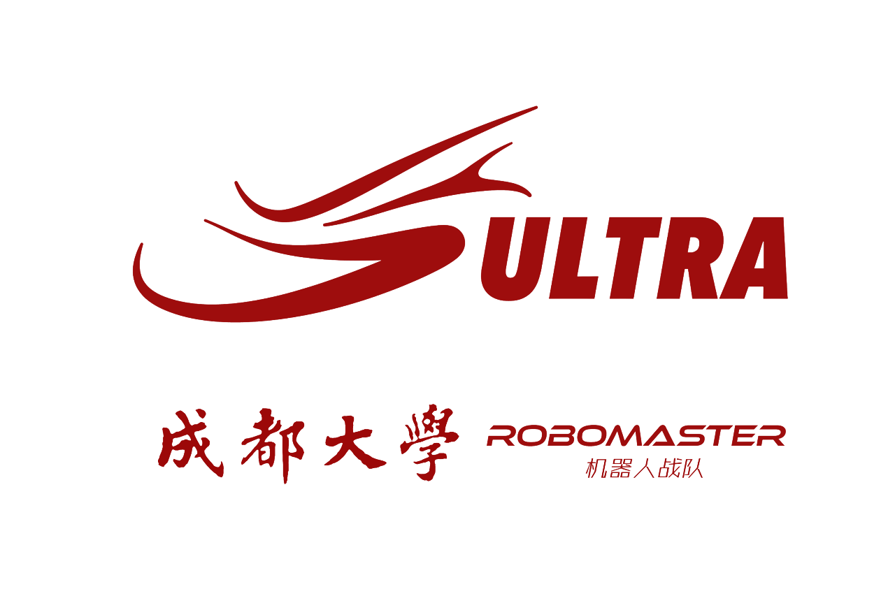
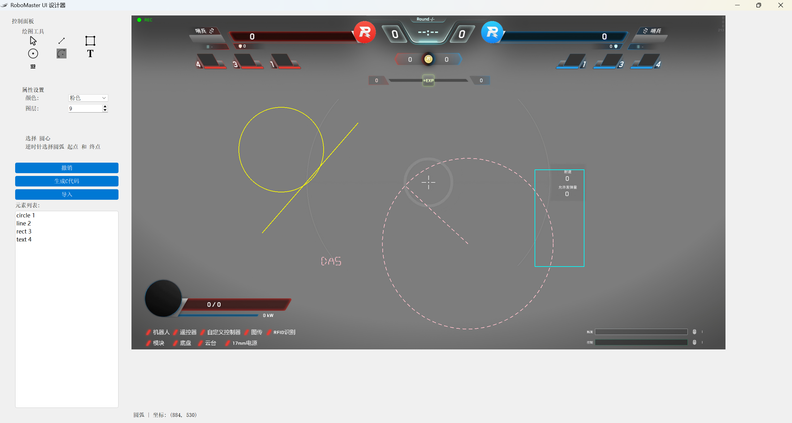

<h1 align="center">
  
   
  <a href="https://ultrarobo.top/">RoboMaster UI 设计器</a>
</h1>

成都大学Ultra战队UI设计器，特地适配了 `bsp_ui.c` 的函数使用，
使用逻辑模仿了机械 *SolidWorks* 的草图绘制，方便上手。

# 🚀快速开始

- 快速绘制静态UI界面，**RM启动！**
- 开发环境 `Windows11 家庭中文版 24H2`，理论上Windows平台均可使用
- 显示器尺寸设置需大于 `1920*1080`，该问题将在后续版本修复
- [立即下载](https://github.com/NGC2237plus/RoboMaster_UI/releases)

---

# 📖目录

- [🚀快速开始](#快速开始)
- [📖目录](#目录)
- [✨ 功能](#-功能)
- [📥 下载](#-下载)
- [🍽 食用方法](#-食用方法)
- [❓ 常见问题](#-常见问题)
- [👨‍💻 作者](#-作者)

# ✨ 功能

- ⬜ **绘制**
    - ✅ 矩形
    - ✅ 圆形
    - ✅ 直线
    - ⬜ 椭圆
    - ✅ 圆弧
    - ⬜ 浮点型 [^float]
    - ⬜ 整型 [^int]
    - ✅ 字符型
    - ⬜ 构造线
    - ⬜ 切线，中点，角度等几何关系
    - ⬜ 其他高级复合图形

[^float]: 浮点型绘制暂时使用**字符**的功能接口，也就是**不可变**的字符串，建议使用ASCLL码

[^int]: 整型绘制暂时使用**字符**的功能接口，也就是**不可变**字符串，建议使用ASCLL码

- ⬜ **编辑**
    - ⬜ 拖拽
    - ✅ 二次修改
    - ⬜ 选择
    - ⬜ 删除
    - ✅ 撤销
    - ⬜ 重做
    - ⬜ 剪裁实体
    - ⬜ 吸附
    - ⬜ 智能尺寸
    - ⬜ 等距实体
    - ⬜ 镜像实体
    - ⬜ 草图阵列
    - ⬜ 显示和隐藏

- ⬜ **C语言代码**
    - **导入**类型（可绘制的都可以导出）
        - ⬜ 矩形
        - ✅ 圆形
        - ✅ 直线
        - ⬜ 椭圆
        - ⬜ 圆弧
        - ⬜ 浮点型
        - ⬜ 整型
        - ✅ 字符型

    - ⬜ **代码功能**
        - ✅ 绘制的函数调用
        - ⬜ 变量定义
        - ⬜ 图形结构体定义与初始化

更多功能欢迎有缘人来开发

# 📥 下载

> [!NOTE]
> 
> 下载地址：[⚡Github Releases](https://github.com/NGC2237plus/RoboMaster_UI/releases)

# 🍽 食用方法

开袋即食

  

> [!WARNING]
> 
> ~~如果显示不合理，请确保你的显示器设置大于`1920*1080`，该问题将在后续版本修复~~，v1.1.0版本已修复
> 

# ❓ 常见问题

1. 整数和浮点数的绘制功能不完整，建议临时用 `ASCLL` 码来文本显示
2. 官方和本设计器角度定义不一样，后续版本修改
   - 官方：`0°` 指 `12` 点钟方向，**顺时针**绘制
   - 设计器：`0°` 指 `3` 点钟方向（X正半轴），**逆时针**绘制
3. 导入代码失败，后续版本修改
   - 导入原理是通过正则表达式匹配绘制函数的参数，如果参数类型不符合会匹配失败
   - 代码需格式化，缺少空格或者换行等也会匹配失败，格式参考导出的代码

# 👨‍💻 作者

[苏打NGC2237](https://github.com/NGC2237plus)

QQ：3093236313
